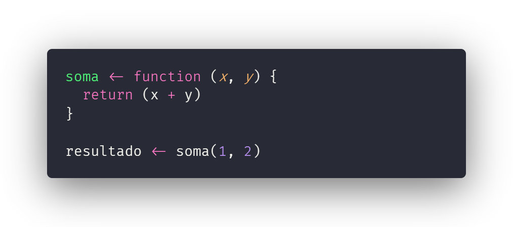

# 2.2 Sintaxe

A sintaxe lembra bastante Ruby com um pouco de PHP, o que pode parecer um pouco estranho no começo mas com o tempo você se acostuma.

Para ter-se uma noção de como seria o design da sintaxe, podemos seguir o exemplo abaixo:

**Curiosidade:** Os nomes de funções e das variáveis são escritas em **camelCase**.