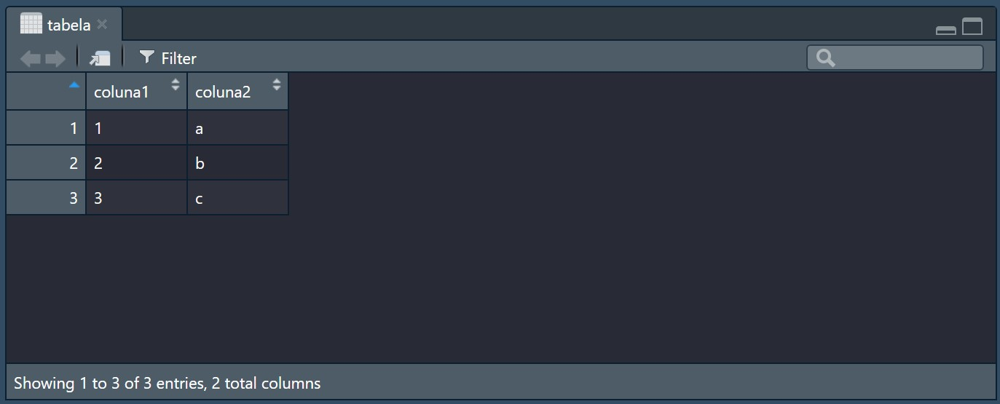

# 2.3 Variáveis

Por mais que o R utilize um pouco do paradigma funcional, ele ainda consegue definir variáveis assim como nas linguagens POO, ou seja, você não precisa lidar com a imutabilidade.

```r
> x <- 10
> x
[1] 10

> x <- 20
> x
[1] 20
```

**Curiosidade:** No R, é normal você utilizar a flecha à esquerda (<-) para definir valores à uma variável, pois quando precisamos definir valores para lista, tabela ou argumentos, utilizamos o igual. Porém, nada lhe impede de utilizar o símbolo de igual quando você quiser definir uma variável, porém isso pode confundir-lhe no decorrer do tempo.

## Tipos

Assi como no Javascript, o R você não tipa as variáveis como as linguagens POO, porém elas implicitamente são definidas como explicaremos a seguir.

```r
# String (character)
> "character"
[1] "character"

# Booleano (logical)
> TRUE
[1] TRUE

# Inteiro (integer)
> 10
[1] 10

# Float (numeric)
> 1.5
[1] 1.5

# Data (Date)
> as.Date("2020-05-07")
[1] "2020-05-07"

# Data e Hora (POSIXct/POSIXlt)
> as.POSIXct("2020-05-07 10:10:10") # Unix
[1] "2020-05-07 10:10:10 -03"

> as.POSIXlt("2020-05-07 10:10:10") # DateTime
[1] "2020-05-07 10:10:10 -03"

# Nulo (NA)
> NA
[1] NA

# Array (c)
> c("Alexandre", "Rafael", "Murilo")
[1] "Alexandre" "Rafael"    "Murilo"

> c(4, 8, 12, 16)
[1]  4  8 12 16

# Lista (list)
> list(1, 2, 3)
[[1]]
[1] 1

[[2]]
[1] 2

[[3]]
[1] 3

> list(x = 1, y = 2)
$x
[1] 1

$y
[1] 2

# Tabela (data.frame)
> data.frame(
  coluna1 = c(1, 2, 3),
  coluna2 = c("a", "b", "c")
)
  coluna1 coluna2
1       1       a
2       2       b
3       3       c
```

**Curiosidade:** No R você pode definir `NULL` ou `NA`. A diferença é que `NA` você utiliza geralmente com variáveis, porém quando definimos `NULL` é geralmente para remover uma propriedade de uma tabela ou lista.

### Numeric

No R, tanto *integer* quanto *double* são `Numerics`, o que pode causar dúvidas nos programadores quando tem o primeiro contato com a linguagem. O deve-se prestar atenção é definir os valores inteiros sempre como integer o que irá utilizar as validações de números inteiros, impossibilitando que haja valores decimais dentro do seu contexto.

### Array

Diferentemente das outras linguagens que utilizam, em sua maioria, colchetes para declarar valores em vetores, no R você precisa utilizar a função `c`, pois com ela você gera vetores.

Nela também, é possível gerar vetores nomeados:

```r
> x <- c(a = 1)
> x
a
1
```

E este, para acessar, você precisa utilizar dois colchetes para que você consiga visualizar o valor pelo nome: `x[["a"]]`.

### Data Frame

Quando você precisa trabalhar, basicamente, com CSV ou TSV, os dados são carregados em uma tabela, o qual denominamos `data.frame`. A partir disso, é possível visualizar esses dados usando a função `View()`, abrindo a tabela diretamente pelo RStudio.

```r
tabela <- data.frame(
  coluna1 = c(1, 2, 3),
  coluna2 = c("a", "b", "c")
)

View(tabela)
```

